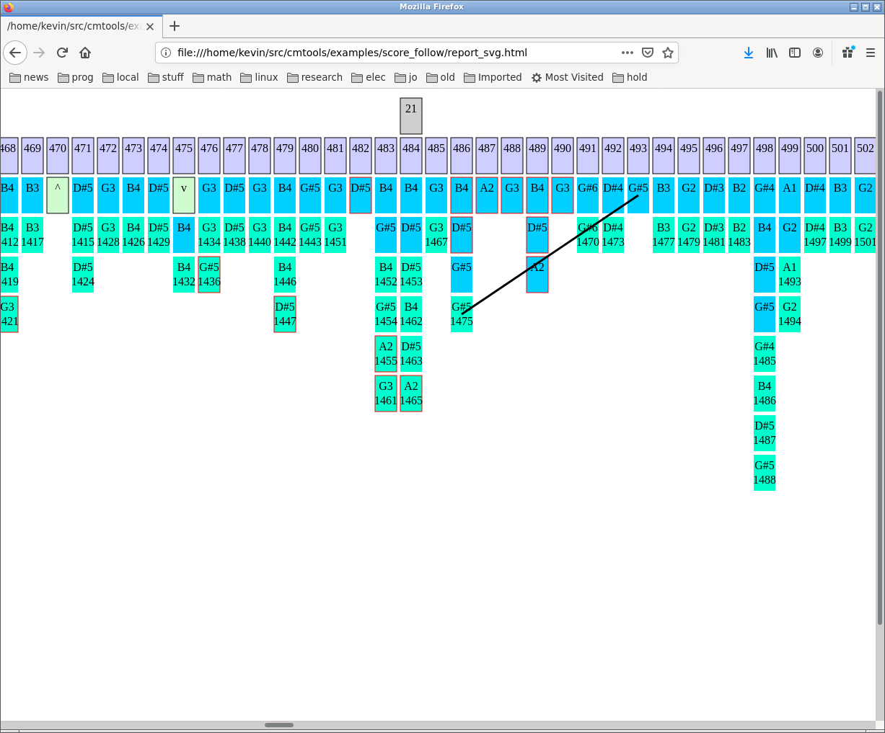

Prerequisites
=============

libcm fftw fftw-devel atlas atlas-devel alsa-lib alsa-lib-devel


About
=====

`cmtools` is a wrapper program for a collection of utility programs implemented by `libcm`.
It is particullary useful for a variety of score processing tasks. 

Electronic Score Generation and Merging
=======================================

Parse a MusicXML file and generate a textual representation which can be augmented manually or programatically.
The textual representation is referred to as a 'score edit file' or sometimes just 'edit file'.

This command will generate an edit file as long as the specified edit file does not already exist.

```
cmtools --score_gen -x <xml_file> -d <edit_fn>
```

The edit file generated by this command provides a way to link additional information
to the score.  [The details for editing the file are here.](https://github.com/currawong-project/cmtools/src/branch/master/doc/xscore_gen.md).

Once the edit file has been completed the MusicXML and edit file information can
be merged to create an 'electronic score' in the form of a CSV file using the following command. 

```
cmtools --score_gen -x <xml_file> -d <edit_fn> {-c <csvOutFn>} {-m <midiOutFn>} {-s <svgOutFn>} {-r report} {-b begMeasNumb} {t begTempoBPM}
```

Along with the CSV file this command can also generate an SVG (scalable vector graphics) file which shows the
augmented score in piano roll form, and a MIDI file which can be used to render the score with a synthesizer.

[READ MORE](https://github.com/currawong-project/cmtools/src/branch/master/doc/xscore_gen.md)


Score Following and Timeline Marker Generator
==============================================

Perform score following based tasks.
Generate the time line marker information used by the performance program resource file.

```
cmtools --score_follow -c <csv_score_fn> -i <midi_in_fn> -r <report_fn> -s <svg_out_fn> -m <midi_out_fn> -t <timeline_fn>
```

If `<midi_out_fn>` is given then the a copy of `<midi_in_fn>` will be created with 
note velocities and sostenuto pedal events from the score.


Score match report output snippet:

```
  Score Score Score MIDI  MIDI MIDI
  Bar   UUID  Pitch UUID  Ptch Vel.
- ----- ----- ----- ----- ---- ----
m     1     3    B3    19   B3 127
m     1     4   D#4    20  D#4 127
m     1     5   G#5    21  G#5 127
m     1    14    E4    25   E4  29
m     1    15   G#3    27  G#3  36
m     1    16    E4    29   E4  43
m     1    17   G#3    31  G#3  50
```

TODO: Show errors
TODO: Show SVG output


Performance Measurement Generators
==================================

Given a performance program resource file generate performance measurements where the internal MIDI file
is used as a substitute for a real player.


```
cmtools --meas_gen -p <pgm_rsrc_fn> -r <report_fn>
```


Example `<pgm_rsrc_fn>`:

``` 
{
  timeLineFn:   "kc/data/round2.js"
  tlPrefixPath: "projects/imag_themes/scores/gen"
  scoreFn:      "score.csv"

  //            pppp  ppp pp  p   mp  mf  f   ff  fff 
     dynRef: [   14,  28, 42, 56, 71, 85, 99, 113,128 ]

}
```

Example call with output file snippet:

```
cmtools --meas_gen -g ~/src/cmtools/examples/perf_meas/pgm_rsrc_round2.js -r ~/src/cmtools/examples/perf_meas/perf_meas_out.js

{
  meas : 
  [
    [  "sec"  "typeLabel"  "val"     "cost" "loc" "evt" "seq" "mark" "typeId" ]
    [  "6002"  "tempo"    34.730932 0.000000  59   76     0    "1"      3 ]
    [  "6002"  "dyn"       0.952381 0.000000  59   76     0    "1"      2 ]
    [  "6002"  "even"      0.600000 0.000000  59   76     0    "1"      1 ]
    [  "6002"  "dyn"       1.000000 0.142857  59   76     0    "2"      2 ]
  ]
}

 ```

Column Descriptions:

Column    |   Description
----------|-----------------------------------------------------
sec       | Score section to which this measurement will be applied.
typeLabel | Measurement type
value     | Measurement value
cost      | Score follower error value (0= perfect match)
loc       | Score location index where this measurement will be applied
evt       | Score event index where this measurement will be applied
seq       | Sequence id.
mark      | Time line marker label from which the measurements were made
typeId    | Measurement type id (numeric id associated with typeLabel)

Note that the event indexes and score locations are best
seen in the score report (as generated by `cmtool --score_report`)
NOT by directly referencing the score CSV file.


Score Report
============

Generate a human readable score report from a score CSV file.

```
cmtools --score_report -c <csvScoreFn> -r <scoreRptFn>"

```

Example report file snippet:

```
evnt  CSV             bar
index line  loctn bar idx type  pitch ETD Dynamic
----- ----- ----- --- --- ----- ----- --- -------
    0     2   1 bar 
    1     3     0   1   0 non    B3               section:6001 
    2     4     0   1   1 non   D#4               
    3     5     0   1   2 non   G#5               
    4     6     1   1   3 ped    dn               
    5     7     2   1   3 ped    dn               
    6     8     3   1   3 non    E4               
    7     9     4   1   4 non   G#3    td ppp     
    8    10     5   1   5 non    E4    td pp      
    9    11     6   1   6 non   G#3    td pp      
   10    12     7   1   7 non   C#2    td p       
   11    13     8   1   8 non    C4    td mp      
   12    14     9   1   9 non   G#3    td mp      
   13    15    10   1  10 non   C#2    td mf      
   14    16    11   1  11 non   A#2    td f       
   15    17    12   1  12 non    C4    td f       
   16    18    13   1  13 non   A#2    td f       
   17    19    14   1  14 non   C#1               


```

Score Merge
===========

Copy the manual edits from 'frag.txt' to the correct location, beginning with measure 284, in the blank edit file 'edit0.txt'.

```
cmtools  --merge_edit -d edit0.txt  -b 284 -k frag.txt -o temp.txt
```

All the events in 'frag.txt' may not be able to be located in 'edit0.txt'. Warning messages will be generated for
each of these events.

```
XScore warning: Sync error: meas:301 18 index:7 8 A#4 (midi:70) edit:!mp+ (RC:14)
XScore warning: Sync error: meas:322 39 index:32 33 C2 (midi:36) edit:!!PPP (RC:14)
XScore warning: Sync error: meas:335 52 index:15 16 D4 (midi:62) edit:!ppp (RC:14)
XScore warning: Sync error: meas:343 60 index:18 19 E5 (midi:76) edit:%%a !mf (RC:14)
XScore warning: Sync error: meas:343 60 index:18 20 D4 (midi:62) edit:!fff (RC:14)
XScore warning: Sync error: meas:343 60 index:18 21 F#4 (midi:66) edit:!fff (RC:14)
XScore warning: Sync error: meas:343 60 index:18 22 G1 (midi:31) edit:!mp (RC:14)
XScore warning: Sync error: meas:343 60 index:18 23 B1 (midi:35) edit:!ff (RC:14)
XScore warning: Sync error: meas:350 67 index:51 54 F4 (midi:65) edit:!mf+ (RC:14)
XScore warning: Sync error: meas:350 67 index:50 55 A#5 (midi:82) edit:!mf+ (RC:14)
```


MIDI File Reports
=================

Generate a MIDI file report and optional SVG piano roll image."

    cmtools --midi_report -i <midiInFn> -r <midiRptFn> {-s <svgOutFn> {--svg_stand_alone_fl} {--svg_pan_zoom_fl}  }


Timeline Report
=================

Generate human readable report from a time line setup file.

    cmtools --timeline_report -t <timelineInFn> -l <tlPrefix> -r <rptOutFn>

tlPrefix is the folder where data files for this timeline are stored.	


Score Follow Report
===================

    cmtools  --score_follow -c round2.csv -i new_round2.mid -r report.txt -s report_svg.html
 
 
SVG Description
---------------

- Red borders around score events that were not matched.
- Red borders around MIDI events that did not match.
- Line is drawn to MIDI events that matched to multiple score events. The lines
are drawn to all score events after the first match.
   
   

Audio Device Test
=================

Real-time audio port test.

This test also excercises the real-time audio buffer which implements most of the global audio control functions.

```


```

```
-s --srate <real>            Audio system sample rate.
-z --hz <real>               Tone frequency in Hertz.
-x --ch_index <uint>         Index of first channel index.
-c --ch_cnt <uint>           Count of audio channels.
-b --buf_cnt <uint>          Count of audio buffers. (e.g. 2=double buffering, 3=triple buffering)
-f --frames_per_buf <uint>   Count of audio channels.
-i --in_dev_index <uint>     Input device index as taken from the audio device report.
-o --out_dev_index <uint>    Output device index as taken from the audio device report.
-r --report_flag             Print a report of the score following processing.
-h --help                    Print this usage information.
-v --version                 Print version information.
-p --parms                   Print the arguments.
```

MIDI Audio Sync (MAS)
=====================

1) Synchronize Audio to MIDI based on onset patterns:

    a. Convert MIDI to audio impulse files:

        mas -m -i <midi_dir | midi_fn >  -o <out_dir> -s <srate>

        Notes:

        * If <midi_dir> is given then use all files in the directory as input otherwise convert a single file.
   
        * The files written to <out_dir> are audio files with impulses written at the location of note on msg's. The amplitude of the the impulse is velocity/127.

   b. Convert the onsets in audio file(s) to audio impulse
      file(s).

      mas -a -i <audio_dir | audio_fn > -o <out_dir>   
          -w <wndMs> -f <hopFactor> -u <chIdx> -r <wnd_frm_cnt> 
          -x <preWndMult> -t <threshold> -z <maxFrqHz> -e <filtCoeff>

      1) If <audio_dir> is given then use all files
         in the directory as input otherwise convert a 
         single file.
      2) The onset detector uses a spectral flux based
         algorithm.
         See cmOnset.h/.c for an explanation of the 
         onset detection parameters.
         

   c) Convolve impulse files created in a) and b) with a 
      Hann window to widen the impulse width.

      mas -c -i <audio_dir | audio_fn > -o <out_dir> -w <wndMs>

      1) If <audio_dir> is given then use all files
         in the directory as input otherwise convert a 
         single file.
      2) <wndMs> gives the width of the Hann window.
      
   d) Synchronize MIDI and Audio based convolved impulse
      files based on their onset patterns.

      mas -y -i <sync_cfg_fn.js> -o <sync_out_fn.js>

      1) The <sync_cfg_fn.js> file has the following format:
        {
          ref_dir : "/home/kevin/temp/mas/midi_conv"    // location of ref files
          key_dir : "/home/kevin/temp/mas/onset_conv"   // location of key files
          hop_ms  : 25                                  // sliding window increment

          sync_array :
          [
            //   ref_fn  wnd_beg_secs wnd_dur_secs  key_fn        key_beg_secs, key_end_secs
            [    "1.aif",    678,         113,    "Piano 3_01.aif",  239.0,     417.0], 
            [    "3.aif",    524,          61,    "Piano 3_06.aif",  556.0,     619.0],
          ]
        }

         Notes:
         a. The 'window' is the section of the reference file which is compared
            to the key file search area <key_beg_secs> to <key_end_secs> by sliding it 
            in increments of 'hop_ms' samples.

         b. Set 'key_end_secs' to 0 to search to the end of the file.

         c. When one key file matches to multiple reference files the
            key files sync recd should be listed consecutively.  This way
            the earlier searches can stop when they reach the beginning 
            of the next sync records search region.  See sync_files().

            Note that by setting  <key_beg_secs> to a non-zero value
            as occurs in the multi-key-file case has a subtle effect of
            changing the master-slave relationship between the reference
            an key file.  

            In general the reference file is the master and the key file
            is the slave.  When a non-zero <key_beg_secs> is given however
            this relationship reverses.  See masCreateTimeLine() for 
            how this is used to assign file group id's during the
            time line creation.

      3) The <sync_out_fn.js> has the following form.
```
         {
           "sync" : 
           {
             "refDir" : "/home/kevin/temp/mas/midi_conv"     
             "keyDir" : "/home/kevin/temp/mas/onset_conv"     
             "hopMs" : 25.000000     

             "array" : 
             [
              
               //
               // sync results for "1.aif" to "Piano 3_01.aif"
               //

               {
                 // The following block of fields were copied from  <sync_cfg_fn.js>. 
                 "refFn"         : "1.aif"         
                 "refWndBegSecs" : 678.000000         
                 "refWndSecs"    : 113.000000         
                 "keyFn"         : "Piano 3_01.aif"         
                 "keyBegSecs"    : 239.000000         
                 "keyEndSecs"    : 417.000000 
        
                 // Sync. location of the 'window' in the key file.
                 // Sample index into the key file which matches to the first sample 
                 // in the reference window.
                 "keySyncIdx" : 25768800     // Offset into the key file of the best match.
    
                 "syncDist"  : 4184.826108   // Match distance score for the sync location.          
                 "refSmpCnt" : 200112000     // Count of samples in the reference file.       
                 "keySmpCnt" : 161884800     // Count of samples in the key file.        
                 "srate"     : 96000.000000  // Sample rate of the reference and key file.
               },
             ]    
           }  
         }
```
2) Create a time line from the results of a synchronization.  A time line is a data structure
   (See cmTimeLine.h/.c) which maintains a time based ordering of Audio files, MIDI files,
   and arbitrary markers.

    mas -g -i <sync_out_fn.js>  -o <time_line_out_fn.js> -R <ref_dir> -K <key_dir> -M <ref_ext> -A <key_ext>

|  <sync_out_fn.js> The output file produced as a result of a previous MIDI <-> Audio synchronization.
|  
|  <ref_dir>        Location of the reference files (MIDI) used for the synchronization. 
|  <ref_ext>        File extension used by the reference files.
|  <key_dir>        Locate of the key files (Audio) used for the synchronization.
|  <key_ext>        File extension used by the key files.

  a. The time line 'trackId' assigned to each time line object is based on the files
     'groupId'. A common group id is given to sets of files which are
     locked in time relative to one another.  For example
     if file B and C are synced to master file A and
     file D is synced to file E which is synced to master
     file F.  Then files A,B,C will be given one group
     id and files D,E and F will be given another group id.
     (See masCreateTimeLine()).

  b. The time line object 'offset' values gives the offset in samples where the object
     begins relative to other objects in the group.  Note that the master object in the
     group may not begin at offset 0 if there are slave objects which start before it.


     

TODO:
=====

* replace round2.csv time with the times in the full fragment MIDI file

* update timeline lite to allow for a synchronized audio file

* change the build setup to default to getting libcm from the system
and allow an option to build it from src/libcm

* for all svg output create a standalone flag that wraps the output in HTML
and another option to load pan-zoom.


* MIDI report output example and description

* Timeline report output example and description


